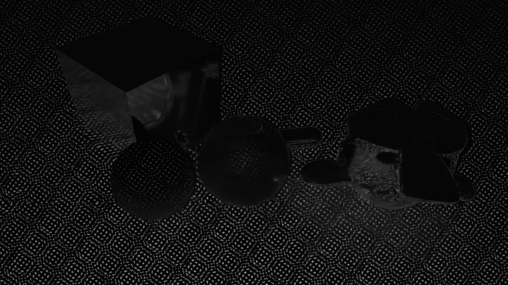
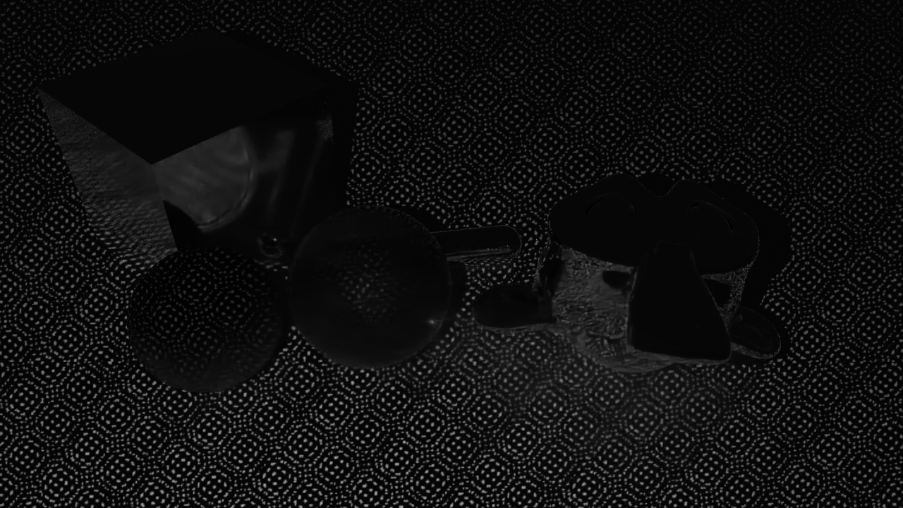
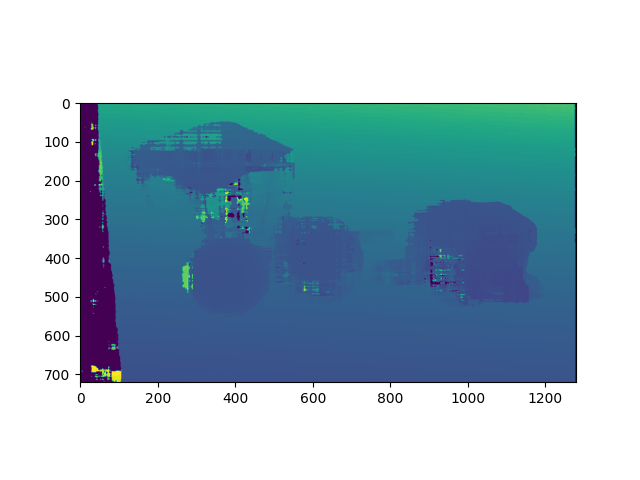

# GPU Acceleration for Depth Map Calculation with CUDA
## Introduction
This is a gpu-accelerated version of depth map calculation from a pair of image captured by two nearby parallel cameras. The pipeline contains three parts: image rectification, stereo matching, and disparity to depth conversion.

The image rectification part relies on opencv. Use

    pip install opencv-contrib-python
to install the dependencies. OpenCV is used to pre-calculate the inverse map, and the remapping process is accelerated with GPU in runtime.

The stereo matching part implements GPU accelerated Semi-Global Matching, referencing to this paper: https://arxiv.org/pdf/1610.04121.pdf, and its corresponding code https://github.com/dhernandez0/sgm.

Disparity to depth conversion is also accelerated with GPU to give space for acceleration of further post processing.

The pipeline is accelerated for a stream of photos captured by consistent cameras. More specifically, the intrinsic matrices and the distortion coefficients of the two cameras, the relative postion of the left and right camera, and the captured image size need to be fixed to fully exploit the acceleration.

## Build

CMake need to be installed. Before building the code, run

    git submodule update --init
to get 3rd party library. To build the code, run `build.sh` under root directory. The default settings only support NVIDIA GPU with compute capability of 7.5, 8.0 and 8.6. To accustom different GPUs, check the compute capability at https://developer.nvidia.com/cuda-gpus and add the value into `src/CMakeLists.txt`. For example, if your GPU's compute capability is of 7.0, then add 

    -gencode=arch=compute_70,code=sm_70
into `CmakeLists.txt`. After building, the `dpcuda` folder can be imported as a python package.

## Documentation
### `dpcuda.DepthEngine(img_h, img_w, k_l, k_r, r2l, min_depth, max_depth, dist_l=None, dist_r=None, rectified=False)`  
Initiate the `DepthEngine` class.

`img_h`: Image height, greater than 32  
`img_w`: Image width, greater than 32  
`k_l`: Left intrinsic matrix  
`k_r`: Right intrinsic matrix  
`r2l`: Extrinsic matrix (right to left)  
`min_depth`: minimum valid depth  
`max_depth`: maximum valid depth  
`dist_l`: Left distortion coefficients  
`dist_r`: Right distortion coefficients  
`rectified`: Whether the input has already been rectified. If already rectified the the runtime can be further reduced
TODO: add instructions for remaining parameters

### `dpcuda.DepthEngine.compute(img_l, img_r)`
Take two images and output the calculated depth map (in meters).

`img_l`: Left infrared/grayscale image (uint8)
`img_r`: Right infrared/grayscale image (uint8)

### `dpcuda.DepthEngine.close()`
Free resources including memory allocated by cuda. This function should be called when the use of the module has ended. If not, memory leak in GPU might occur.

## Result
Run `test.py` to evaluate the runtime and result. The input is in folder `test_images`， which are two 720x1280 images:
### Left Image

### Right Image

Tested on RTX 3060, 100 calls of `dpcuda.DepthEngine.compute(img_l, img_r)` takes ~0.57 second with rectification. The generated depth map is as follow:

