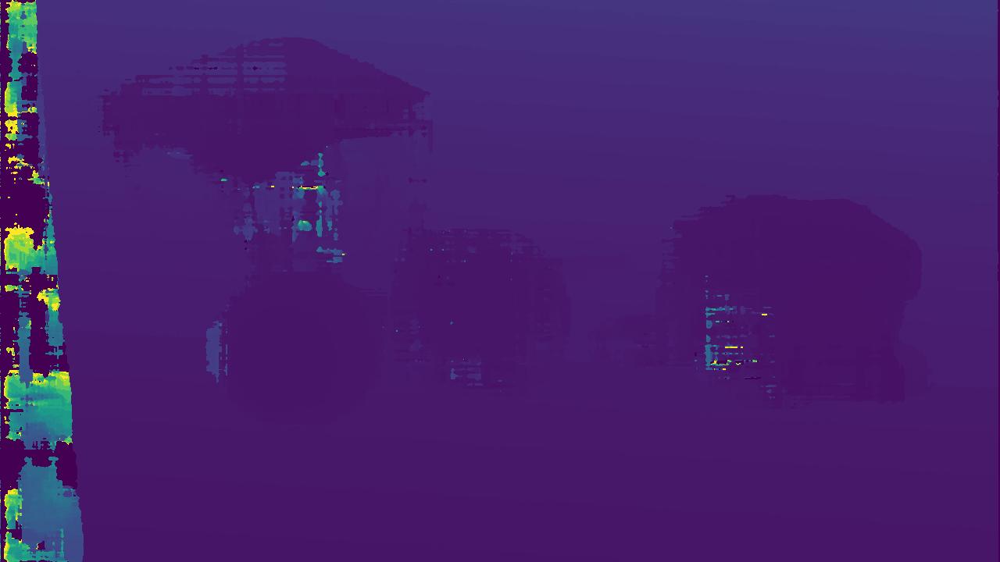

# GPU Acceleration for Depth Map Calculation with CUDA
For now the acceleration for stereo matching (rectified images -> disparity map) has been done. The implementation is referencing to this paper: https://arxiv.org/pdf/1610.04121.pdf, and its corresponding code https://github.com/dhernandez0/sgm. To build the code, run `build.sh`. The default settings only support NVIDIA GPU with compute capability of 7.5, 8.0 and 8.6. To accustom different GPUs, check the compute capability at https://developer.nvidia.com/cuda-gpus and add the value into `CMakeLists.txt`. A `depth_cuda.so` library will be built under `build` folder, which can be then imported into python. For now the `depth_cuda` package includes three functions:

`init()`: this function initiates the GPU streams and must be called (and only once in the program) before `compute_disparity()`.

`compute_disparity(left, right)`: takes two rectified images (uint8) and output calculated disparity map (using SGM algorithm).

`finish()`: this function should be called when GPU will not be used anymore to free resources.

Run `test.py` to evaluate the run time. The test input is in folder `test_images`， which are two 1280x720 images. After running test.py the calculated disparity map `disp.png` will be generated in the root folder. Tested on RTX 3060, 100 calls of `compute_disparity(left, right)` takes about 0.45 second. The generated disparity map is as follow:
